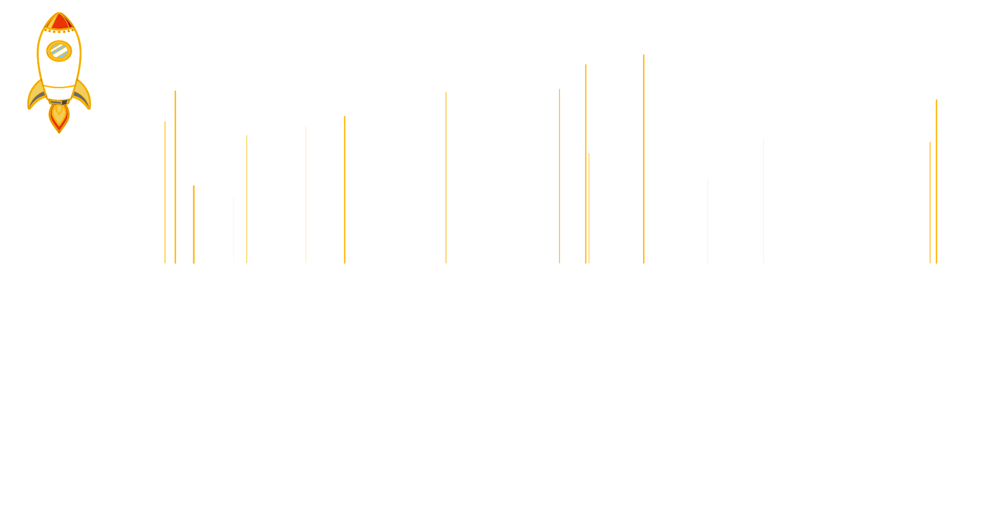

### Hey 👋🏽, I'm [John Garcia!](https://johnkegd.netlify.app) 

 

 
 

Software engineer passionate about technology, currently living in Swtizerland🇨🇭. I'm a member of an amazing coders community [@SoloLearn](https://www.sololearn.com/Profile/6936974/), working for 👨🏽‍💻 [@Ajila](https://www.ajila.com), member of [@helpwithcovid](https://helpwithcovid.com/). Besides programming and learning, I really enjoy a good caffe, weird experiments with threejs library, and the road with my beautiful motorcycle 🏍.

**Talking about Personal Stuffs:**

- 👨🏽‍💻 I’m currently working on [Cerescreations](https://cerescreations.netlify.app) portofolio implementing my two loves Threejs and Svelte 🧡;
- 🌱 Learning Svelte, Spring Boot Framework and Threejs 3d animation library 🧡;
- 🤔 Looking for help with Data Structures and Algorithms;
- 💬 Ask me about anything, I am happy to help;
- 📫 How to reach me: johnkegd@gmail.com;
- ⚡ Fun fact: learning to code helped me cook better and faster. 😂;
- 😎 Cool fact: My Girldfriend <a href="https://github.com/Gwendolin-Anna">@gwendolinanna</a> is the number one🏆 in [@SoloLearn](https://www.sololearn.com/profile/12242887) Swtizerland🇨🇭. So she's coders too 🥰. Here her currently work on progress [Gwendolinanna](https://www.gwendolinanna.com) portfolio;
- 😎 Cool fact: My Brother [@Manuelmid](https://github.com/manuelmid) is currently learning code and is a very good and extremely creative 3d modeller. so my path with the 3d world seems to be predestined. Contact for any work [Cerescrations](https://www.fiverr.com/cerescrations);

---

**Languages and Skills:**

<code>

</code>

<code>

</code>

<code>

</code>

<code>

</code>

<code>

</code>

<code>

</code>

<code>

</code>

  

---

**Github stats and others:**

